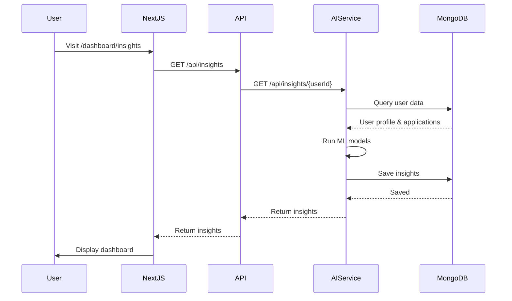

# AI Insights Dashboard - Complete Implementation Guide

## Overview

This guide covers the complete implementation of the AI Insights Dashboard for the EduLen platform. The dashboard provides students with AI-powered insights about their university application profiles, including admission predictions, recommendations, and faculty matches.

## Architecture

### Frontend Components (Next.js)
- **Location**: `/src/components/dashboard/ai-insights/`
- **Framework**: React 19 + Next.js 15
- **State Management**: TanStack Query for server state
- **Styling**: Tailwind CSS + shadcn/ui
- **Charts**: Recharts
- **Animations**: Framer Motion

### Backend Integration
- **AI Service**: FastAPI microservice (port 8000)
- **Database**: MongoDB for insights storage
- **Authentication**: Better Auth with JWT tokens
- **API Routes**: Next.js API routes proxy to AI service

## File Structure

```
/home/ismail/edulen/
├── src/
│   ├── types/
│   │   └── insights.ts                 # TypeScript types
│   ├── hooks/
│   │   ├── useAIInsights.ts           # Main insights hook
│   │   ├── useAdmissionPrediction.ts   # Predictions hook
│   │   ├── useFacultyMatches.ts        # Faculty hook
│   │   └── useProfileAnalysis.ts       # Profile analysis hook
│   ├── app/api/insights/
│   │   ├── route.ts                    # Main insights API
│   │   ├── refresh/route.ts            # Refresh insights
│   │   ├── predictions/route.ts        # Predictions API
│   │   ├── profile/route.ts            # Profile analysis API
│   │   ├── recommendations/route.ts    # Recommendations API
│   │   ├── faculty/route.ts            # Faculty matches API
│   │   └── export/route.ts             # Export functionality
│   └── components/dashboard/ai-insights/
│       ├── AIInsightsDashboard.tsx     # Main dashboard
│       ├── OverviewTab.tsx             # Overview section
│       ├── ProfileAnalysisTab.tsx      # Profile analysis
│       ├── RecommendationsTab.tsx      # Recommendations
│       ├── FacultyMatchesTab.tsx       # Faculty matches
│       ├── TimelineTab.tsx             # Timeline view
│       ├── AdmissionProbabilityChart.tsx  # Probability chart
│       ├── PeerComparisonChart.tsx     # Comparison chart
│       ├── SuccessFactorsChart.tsx     # Success factors chart
│       ├── ProfileStrengthMeter.tsx    # Strength meter utility
│       ├── PriorityBadge.tsx           # Priority badge utility
│       ├── ImpactEstimator.tsx         # Impact visualizer
│       ├── ProgressTracker.tsx         # Progress tracker
│       ├── ComparisonBar.tsx           # Comparison bar chart
│       ├── ExportInsights.tsx          # Export dialog
│       ├── InsightNotification.tsx     # Notifications
│       ├── ApplicationInsightsCard.tsx # Application card
│       ├── index.ts                    # Exports
│       ├── README.md                   # Documentation
│       └── example-usage.tsx           # Usage examples
```

## Installation Steps

### 1. Dependencies

Ensure these packages are installed:

```bash
# Already in package.json, but verify:
npm install recharts framer-motion date-fns
npm install @tanstack/react-query
npm install sonner  # For toast notifications
```

### 2. Environment Variables

Add to `.env.local`:

```env
# AI Service URL (default for local development)
AI_SERVICE_URL=http://localhost:8000

# MongoDB connection
MONGODB_URI=mongodb://localhost:27017/edulens

# Better Auth (should already exist)
BETTER_AUTH_SECRET=your-secret-key
BETTER_AUTH_URL=http://localhost:3000
```

### 3. Start Services

```bash
# Terminal 1: Start AI service
cd ai_service
./start.sh

# Terminal 2: Start Next.js
npm run dev
```

## Integration Guide

### Basic Integration

#### 1. Create an Insights Page

Create `/src/app/dashboard/insights/page.tsx`:

```tsx
import { AIInsightsDashboard } from '@/components/dashboard/ai-insights';
import { auth } from '@/lib/auth';
import { redirect } from 'next/navigation';

export default async function InsightsPage() {
  const session = await auth.api.getSession({
    headers: await headers(),
  });

  if (!session?.user) {
    redirect('/signin');
  }

  return (
    <div className="container mx-auto p-6">
      <AIInsightsDashboard userId={session.user.id} />
    </div>
  );
}
```

#### 2. Add Navigation Link

Update `/src/components/dashboard/Sidebar.tsx`:

```tsx
import { Sparkles } from 'lucide-react';

// Add to navigation items:
{
  href: '/dashboard/insights',
  icon: Sparkles,
  label: 'AI Insights',
  badge: 'NEW',
}
```

### Advanced Integration

#### Application-Specific Insights

```tsx
// /src/app/dashboard/applications/[id]/page.tsx
import { AIInsightsDashboard } from '@/components/dashboard/ai-insights';

export default async function ApplicationPage({ params }: { params: { id: string } }) {
  const session = await auth.api.getSession({ headers: await headers() });

  return (
    <AIInsightsDashboard
      userId={session.user.id}
      applicationId={params.id}
    />
  );
}
```

#### Dashboard Overview Cards

```tsx
// /src/app/dashboard/page.tsx
import { ApplicationInsightsCard } from '@/components/dashboard/ai-insights';

export default function DashboardPage() {
  const applications = await getApplications();

  return (
    <div className="grid grid-cols-1 md:grid-cols-2 lg:grid-cols-3 gap-4">
      {applications.map((app) => (
        <ApplicationInsightsCard
          key={app.id}
          insights={app.insights}
          onViewDetails={() => router.push(`/insights/${app.id}`)}
        />
      ))}
    </div>
  );
}
```

#### Notification System

```tsx
// /src/app/layout.tsx or dashboard layout
import { NotificationCenter } from '@/components/dashboard/ai-insights';

export default function Layout({ children }) {
  const [notifications, setNotifications] = useState([]);

  // Fetch notifications from API
  useEffect(() => {
    fetch('/api/insights/notifications')
      .then(res => res.json())
      .then(setNotifications);
  }, []);

  return (
    <>
      {children}
      <NotificationCenter
        notifications={notifications}
        onDismiss={(id) => {
          // Mark as read
          fetch(`/api/insights/notifications/${id}/read`, { method: 'POST' });
          setNotifications(prev => prev.filter(n => n.id !== id));
        }}
      />
    </>
  );
}
```

## Backend Implementation (AI Service)

The frontend expects these API endpoints from the AI service:

### Required Endpoints

```python
# ai_service/app/api/routes/insights.py

from fastapi import APIRouter, Depends
from app.models.insights import AIInsights, RefreshRequest

router = APIRouter()

@router.get("/api/insights/{user_id}")
async def get_insights(user_id: str) -> AIInsights:
    """Get all AI insights for a user"""
    # Implementation:
    # 1. Fetch user profile data
    # 2. Fetch applications
    # 3. Run ML models for predictions
    # 4. Generate recommendations
    # 5. Find faculty matches
    # 6. Create timeline
    # 7. Return comprehensive insights
    pass

@router.post("/api/insights/{user_id}/refresh")
async def refresh_insights(user_id: str, request: RefreshRequest):
    """Regenerate insights"""
    pass

@router.get("/api/insights/{user_id}/predictions")
async def get_predictions(user_id: str):
    """Get admission predictions"""
    pass

@router.get("/api/insights/{user_id}/profile")
async def get_profile_analysis(user_id: str):
    """Get profile strengths/weaknesses"""
    pass

@router.get("/api/insights/{user_id}/recommendations")
async def get_recommendations(user_id: str):
    """Get personalized recommendations"""
    pass

@router.get("/api/insights/faculty")
async def get_faculty_matches(user_id: str, university_id: str = None):
    """Get faculty matches"""
    pass

@router.post("/api/insights/{user_id}/export")
async def export_insights(user_id: str, options: ExportOptions):
    """Export insights as PDF or JSON"""
    pass
```

### MongoDB Schema

```javascript
// Insights Collection
{
  _id: ObjectId,
  userId: String,
  overall: {
    profileScore: Number,
    admissionProbabilityAverage: Number,
    totalApplications: Number,
    reachCount: Number,
    targetCount: Number,
    safetyCount: Number,
    dataCompleteness: Number,
    lastAnalyzed: Date
  },
  predictions: [{
    universityId: String,
    universityName: String,
    programName: String,
    probability: Number,
    confidenceInterval: [Number, Number],
    category: String, // reach/target/safety
    keyFactors: [{
      category: String,
      name: String,
      impact: Number,
      description: String
    }]
  }],
  strengths: [/* ProfileStrength */],
  weaknesses: [/* ProfileWeakness */],
  recommendations: [/* Recommendation */],
  facultyMatches: [/* FacultyMatch */],
  timeline: [/* TimelineSuggestion */],
  comparisons: [/* ProfileComparison */],
  successFactors: [/* SuccessFactor */],
  trends: [/* TrendDataPoint */],
  generatedAt: Date,
  expiresAt: Date,
  version: Number
}
```

## Data Flow



## Performance Optimization

### Caching Strategy

```typescript
// TanStack Query configuration
const queryClient = new QueryClient({
  defaultOptions: {
    queries: {
      staleTime: 5 * 60 * 1000, // 5 minutes
      cacheTime: 30 * 60 * 1000, // 30 minutes
      refetchOnWindowFocus: false,
      retry: 2,
    },
  },
});
```

### Lazy Loading

```tsx
// Lazy load heavy components
const AdmissionProbabilityChart = lazy(() =>
  import('./AdmissionProbabilityChart').then(m => ({ default: m.AdmissionProbabilityChart }))
);
```

### Code Splitting

Next.js automatically code-splits by route. Each insights page is a separate bundle.

## Testing

### Unit Tests

```typescript
// __tests__/components/ai-insights/AIInsightsDashboard.test.tsx
import { render, screen } from '@testing-library/react';
import { AIInsightsDashboard } from '@/components/dashboard/ai-insights';
import { QueryClient, QueryClientProvider } from '@tanstack/react-query';

test('renders dashboard', async () => {
  const queryClient = new QueryClient();

  render(
    <QueryClientProvider client={queryClient}>
      <AIInsightsDashboard userId="test-user" />
    </QueryClientProvider>
  );

  expect(await screen.findByText('AI Insights Dashboard')).toBeInTheDocument();
});
```

### Integration Tests

```typescript
// __tests__/api/insights/route.test.ts
import { GET } from '@/app/api/insights/route';

test('returns insights for authenticated user', async () => {
  const request = new Request('http://localhost:3000/api/insights', {
    headers: {
      cookie: 'session=valid-session-token'
    }
  });

  const response = await GET(request);
  expect(response.status).toBe(200);

  const data = await response.json();
  expect(data).toHaveProperty('overall');
  expect(data).toHaveProperty('predictions');
});
```

## Deployment Checklist

- [ ] Environment variables configured
- [ ] AI service running and accessible
- [ ] MongoDB connection working
- [ ] Authentication configured
- [ ] API routes tested
- [ ] Components rendering correctly
- [ ] Charts displaying data
- [ ] Export functionality working
- [ ] Mobile responsive
- [ ] Dark mode working
- [ ] Loading states handled
- [ ] Error states handled
- [ ] Performance optimized

## Monitoring

### Metrics to Track

1. **Page Load Time**: Target < 3 seconds
2. **Time to Interactive**: Target < 5 seconds
3. **API Response Time**: Target < 1 second
4. **Insights Generation Time**: Target < 5 seconds
5. **Error Rate**: Target < 1%

### Logging

```typescript
// Add to components
import { useEffect } from 'react';

useEffect(() => {
  console.log('Insights loaded', {
    userId,
    timestamp: new Date().toISOString(),
    dataCompleteness: insights?.overall.dataCompleteness
  });
}, [insights]);
```

## Troubleshooting

### Common Issues

#### 1. Insights not loading

**Symptoms**: Spinner shows indefinitely

**Solutions**:
- Check AI service is running: `curl http://localhost:8000/health`
- Verify MongoDB connection
- Check browser console for errors
- Verify authentication token is valid

#### 2. Charts not rendering

**Symptoms**: Empty space where chart should be

**Solutions**:
- Ensure Recharts is installed
- Check data format matches TypeScript types
- Verify ResponsiveContainer has height
- Check console for errors

#### 3. API 401 Unauthorized

**Symptoms**: "Unauthorized" error in console

**Solutions**:
- Verify user is logged in
- Check session token in cookies
- Verify Better Auth configuration
- Check JWT_SECRET matches between services

#### 4. Slow performance

**Symptoms**: Dashboard takes > 5 seconds to load

**Solutions**:
- Enable caching in TanStack Query
- Optimize MongoDB queries
- Add database indexes
- Implement pagination for large datasets
- Use React.memo for expensive components

## Customization

### Theming

Override colors in `tailwind.config.ts`:

```typescript
theme: {
  extend: {
    colors: {
      'insights-primary': '#your-color',
      'insights-success': '#your-color',
      // etc.
    }
  }
}
```

### Custom Components

Create custom tab:

```tsx
// CustomTab.tsx
export function CustomTab({ data }: { data: any }) {
  return (
    <div>
      {/* Your custom visualization */}
    </div>
  );
}

// Add to AIInsightsDashboard.tsx
<TabsContent value="custom">
  <CustomTab data={insights.customData} />
</TabsContent>
```

## Security Considerations

1. **Authentication**: All API routes verify session
2. **Authorization**: Users can only access their own insights
3. **Data Validation**: All inputs validated with Zod schemas
4. **XSS Prevention**: All user input sanitized
5. **CSRF Protection**: Better Auth handles CSRF tokens
6. **Rate Limiting**: Implement on API routes

## Future Enhancements

1. **Real-time Updates**: WebSocket for live insights updates
2. **AI Chat**: Conversational interface for insights
3. **Comparison Tool**: Compare profiles with peers
4. **Mobile App**: React Native version
5. **Email Digests**: Weekly insights email
6. **Predictive Alerts**: Proactive notifications
7. **A/B Testing**: Test recommendation effectiveness
8. **Analytics**: Track which insights are most helpful

## Support

For issues or questions:
- Check this guide first
- Review component README
- Check example-usage.tsx
- Inspect browser console
- Review API responses
- Check AI service logs

## License

Part of the EduLen project.
